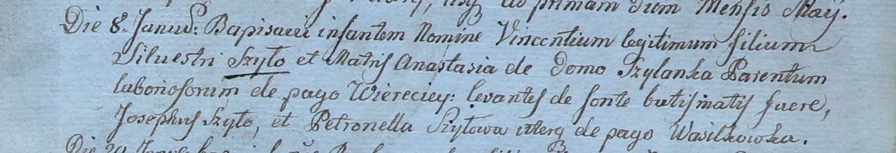

**Шило Петронеля (Szyłowa Petronella)**

8 января 1800 г -- крестная мать Сильвестра, сына Шил Сильвестра и
Анастасии с деревни Веретей (НИАБ 937-4-32, лист 1, №1/1800-р).

**НИАБ 937-4-32:** Лист 1. **Метрическая запись №1/1800-р.**

Дедиловичский костел Наисвятейшего Сердца Иисуса. 8 января 1800 года.
Метрическая запись о крещении.

Szyło Vincenti -- сын крестьян с деревни Веретей.

Szyło Silvester -- отец.

Szyłowa Anastasia z Szył -- мать.

Szyło Joseph -- крестный отец, с деревни Васильковка.

Szyłowa Petronella -- крестная мать, с деревни Васильковка.

Linhart Hyacinthus -- ксёндз.
