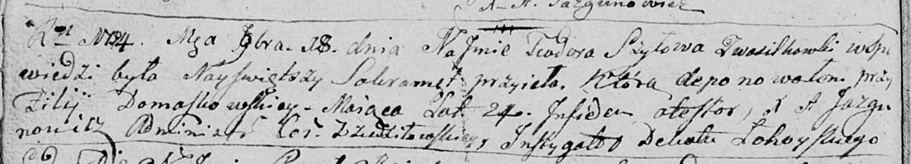

**Шило Тодора (Szyłowa Teodora)**

18 сентября 1794 г -- отпевание, умерла в возрасте 24 года (родилась
около 1770 г) (НИАБ 136-13-919, лист 2об, №33/1794-у (ориг)).

**НИАБ 136-13-919:** Лист 2об. **Метрическая запись №33/1794-у (ориг).**

Дедиловичская Покровская церковь. 18 сентября 1794 года. Метрическая
запись об отпевании.

Szyłowa Teodora -- умершая, 24 года, с деревни Васильковка, похоронена
при филии церкви Домашкевичской.

Jazgunowicz Antoni -- ксёндз.
