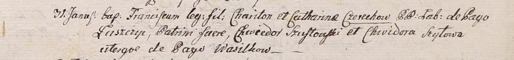

**Шило Хведора (Szyłowa Chwiedora)**

31 января 1801 г -- крестная мать Франциска, сына Харытона и Катерыны
Церахов с деревни Лустичи (НИАБ 937-4-32, лист 4, №4/1800-р).

**НИАБ 937-4-32:** Лист 4. **Метрическая запись №4/1801-р.**

Дедиловичский костел Наисвятейшего Сердца Иисуса. 31 января 1801 года.
Метрическая запись о крещении.

Czerech Francisc -- сын крестьян с деревни Лустичи.

Czerecz Chariton -- отец.

Czerechowa Catharina -- мать.

Szustowski Chwiedor -- крестный отец, с деревни Васильковичи.

Szyłowa Chwiedora -- крестная мать, с деревни Васильковичи.

Linhart Hyacinthus -- ксёндз.
