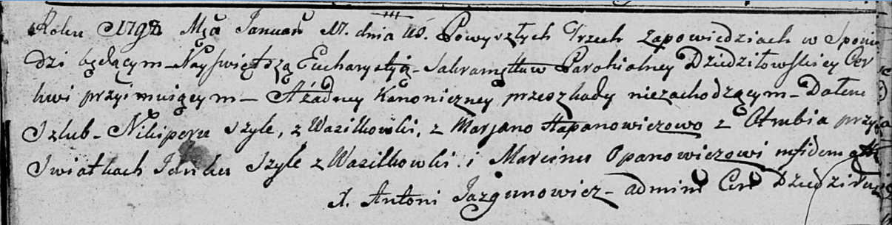

**Шило Янка (Szyło Janka)**

17 января 1798 года -- свидетель венчания Никипора Шило с деревни
Васильковка и Марьяны Гапанович с деревни Отруб (НИАБ 136-13-920, лист
5, №1/1798-б (ориг)).

**НИАБ 136-13-920:** Лист 5. **Метрическая запись №1/1798-б (ориг).**

Дедиловичская Покровская церковь. 17 января 1798 года. Метрическая
запись о венчании.

Szyło Nikiper -- жених, с деревни Васильковка.

Hapanowiczowa Marjana -- невеста, с деревни Отруб.

Szyło Janka -- свидетель, с деревни Васильковка.

Opanowicz Marcin -- свидетель.

Jazgunowicz Antoni -- ксёндз.
