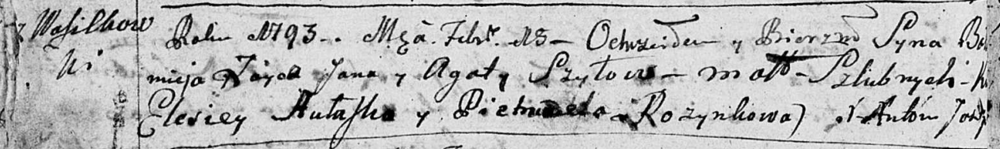
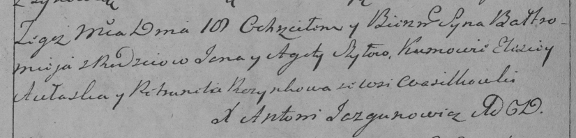

**Шило Агата (Szyłowa Agata)**

2 января 1788 г -- крещение сына Сильвестра (НИАБ 136-13-894, лист 3об,
№3/1788-р (ориг)).

9 сентября 1790 г -- крещение дочери Анны (НИАБ 136-13-894, лист 11,
№64/1790-р (ориг)).

18 февраля 1793 г -- крещение сына Варфоломея (НИАБ 136-13-894, лист
18об, №18/1793-р (ориг)), (РГИА 823-2-18, лист 246, №7/1793-р (коп)).

6 января 1795 г -- крещение дочери Татьяны (НИАБ 136-13-894, лист 27об,
№4/1796-р (ориг)).

13 апреля 1798 г -- крещение сына Мартина (НИАБ 136-13-894, лист 35об,
№16/1798-р (ориг)), (РГИА 823-2-18, лист 263, №16/1798-р (коп)).

8 ноября 1799 г -- крещение дочери Барбары (НИАБ 1781-27-199, лист 129,
№49/1799-р).

**НИАБ 136-13-894:** Лист 3об. **Метрическая запись №3/1788-р (ориг).**

Дедиловичская Покровская церковь. 2 января 1788 года. Метрическая запись
о крещении.

Szyło Sylwester -- сын родителей с деревни Васильковка.

Szyło Jan -- отец.

Szyłowa Agata -- мать.

Aułaska Aleś - кум.

Rozynkowa Magdalena - кума.

Jazgunowicz Antoniusz -- ксёндз.

**НИАБ 136-13-894:** Лист 11. **Метрическая запись №64/1790-р (ориг).**

Дедиловичская Покровская церковь. 9 сентября 1790 года. Метрическая
запись о крещении.

Szyłowna Anna -- дочь родителей с деревни Васильковка.

Szyło Jan -- отец.

Szyłowa Agata -- мать.

Aułaska Aleś? - кум.

Rozynkowa Magdalena - кума.

Jazgunowicz Antoni -- ксёндз.

**НИАБ 136-13-894:** Лист 18-об. **Метрическая запись №18/1793-р
(ориг).**

Дедиловичская Покровская церковь. 18 февраля 1793 года. Метрическая
запись о крещении.

Szyło Bałtromiej -- сын родителей с деревни Васильковка.

Szyło Jan -- отец.

Szyłowa Agata -- мать.

Aułasko Elesiey - кум.

Rozynkowa Pietrunela - кума.

Jazgunowicz Antoni -- ксёндз.

**РГИА 823-2-18:** Лист 246об. **Метрическая запись №7/1793-р (коп).**

Дедиловичская Покровская церковь. 18 февраля 1793 года. Метрическая
запись о крещении.

Szyło Bałtromiey -- сын родителей с деревни Васильковка.

Szyło Jan -- отец.

Szyłowa Agata -- мать.

Aułaska Elisiey -- кум.

Rozynkowa Petrunela -- кума.

Jazgunowicz Antoni -- ксёндз.

**НИАБ 136-13-894:** Лист 27об. **Метрическая запись №4/1796-р (ориг).**

Дедиловичская Покровская церковь. 6 января 1796 года. Метрическая запись
о крещении.

Szyłowa Taсiana -- дочь родителей с деревни Васильковка.

Szyło Jan -- отец.

Szyłowa Agata -- мать.

Awłasko Aleś - кум.

Rozinkowa Petrunela - кума.

Jazgunowicz Antoni -- ксёндз.

**НИАБ 136-13-894:** Лист 35-об. **Метрическая запись №16.**

Дедиловичская Покровская церковь. 13 апреля 1798 года. Метрическая
запись о крещении.

Szyło Marcin -- сын родителей с деревни Васильковка.

Szyło Jan -- отец.

Szyłowa Agata -- мать.

Awłasko Alexander - кум.

Rozynkowa Magdalena - кума.

Moroz A. -- ксёндз, администратор Прусевичской церкви.

**РГИА 823-2-18:** Лист 263. **Метрическая запись №16/1798-р (коп).**

Дедиловичская Покровская церковь. 13 апреля 1798 года. Метрическая
запись о крещении.

Szyło Marcin -- сын родителей с деревни Васильковка.

Szyło Jan -- отец.

Szyłowa Agata -- мать.

Awłasko Alexander -- кум.

Rozynkowa Magdalena -- кума.

Jazgunowicz Antoni -- ксёндз.

**НИАБ 1781-27-199:** Лист 129. **Метрическая запись №49/1799-р.**

Дедиловичский костел Наисвятейшего Сердца Иисуса. 8 ноября 1799 года.
Метрическая запись о крещении.

Szyłowna Barbara -- дочь крестьян с деревни Васильковка.

Szyło Joann -- отец.

Szyłowa Agatha -- мать.

Aułasko Alexiey -- крестный отец.

Rozinkowa Magdalena -- крестная мать.

Linhart Hyacinthus -- ксёндз.
