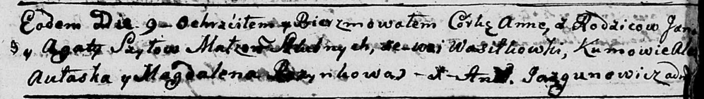

**Шило Анна Янова (Szyłowna Anna)**

9 сентября 1790 г -- крещение (НИАБ 136-13-894, лист 11, №64/1790-р
(ориг)).

**НИАБ 136-13-894:** Лист 11. **Метрическая запись №64/1790-р (ориг).**

Дедиловичская Покровская церковь. 9 сентября 1790 года. Метрическая
запись о крещении.

Szyłowna Anna -- дочь родителей с деревни Васильковка.

Szyło Jan -- отец.

Szyłowa Agata -- мать.

Aułaska Aleś? - кум.

Rozynkowa Magdalena - кума.

Jazgunowicz Antoni -- ксёндз.
