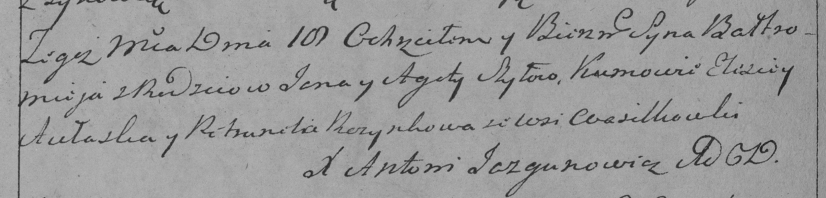

**Шило Балтромей Янов (Szyło Bałtromiey)**

18 февраля 1793 г -- крещение (НИАБ 136-13-894, лист 18об, №18/1793-р
(ориг)), (РГИА 823-2-18, лист 246, №7/1793-р (коп)).

**НИАБ 136-13-894:** Лист 18-об. **Метрическая запись №18/1793-р
(ориг).**

Дедиловичская Покровская церковь. 18 февраля 1793 года. Метрическая
запись о крещении.

Szyło Bałtromiej -- сын родителей с деревни Васильковка.

Szyło Jan -- отец.

Szyłowa Agata -- мать.

Aułasko Elesiey - кум.

Rozynkowa Pietrunela - кума.

Jazgunowicz Antoni -- ксёндз.

**РГИА 823-2-18:** Лист 246об. **Метрическая запись №7/1793-р (коп).**

Дедиловичская Покровская церковь. 18 февраля 1793 года. Метрическая
запись о крещении.

Szyło Bałtromiey -- сын родителей с деревни Васильковка.

Szyło Jan -- отец.

Szyłowa Agata -- мать.

Aułaska Elisiey -- кум.

Rozynkowa Petrunela -- кума.

Jazgunowicz Antoni -- ксёндз.
