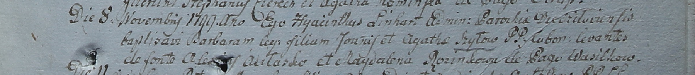

**Шило Барбара Янова (Szyłowna Barbara)**

8 ноября 1799 г -- крещение (НИАБ 1781-27-199, лист 129, №49/1799-р).

**НИАБ 1781-27-199:** Лист 129. **Метрическая запись №49/1799-р.**

Дедиловичский костел Наисвятейшего Сердца Иисуса. 8 ноября 1799 года.
Метрическая запись о крещении.

Szyłowna Barbara -- дочь крестьян с деревни Васильковка.

Szyło Joann -- отец.

Szyłowa Agatha -- мать.

Aułasko Alexiey -- крестный отец.

Rozinkowa Magdalena -- крестная мать.

Linhart Hyacinthus -- ксёндз.
