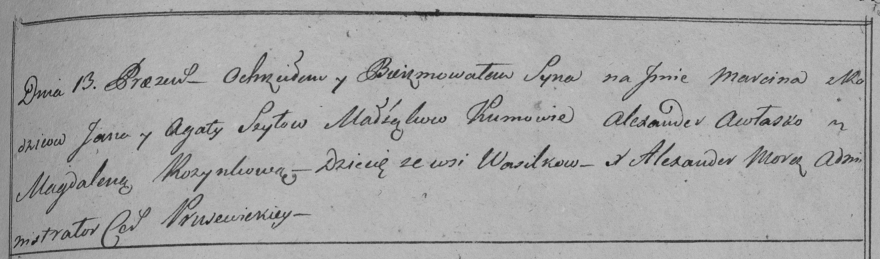

**Шило Мартин Янов (Szyło Marcin)**

13 апреля 1798 г -- крещение (НИАБ 136-13-894, лист 35об, №16/1798-р
(ориг)), (РГИА 823-2-18, лист 263, №16/1798-р (коп)).

**НИАБ 136-13-894:** Лист 35-об. **Метрическая запись №16.**

Дедиловичская Покровская церковь. 13 апреля 1798 года. Метрическая
запись о крещении.

Szyło Marcin -- сын родителей с деревни Васильковка.

Szyło Jan -- отец.

Szyłowa Agata -- мать.

Awłasko Alexander - кум.

Rozynkowa Magdalena - кума.

Moroz A. -- ксёндз, администратор Прусевичской церкви.

**РГИА 823-2-18:** Лист 263. **Метрическая запись №16/1798-р (коп).**

Дедиловичская Покровская церковь. 13 апреля 1798 года. Метрическая
запись о крещении.

Szyło Marcin -- сын родителей с деревни Васильковка.

Szyło Jan -- отец.

Szyłowa Agata -- мать.

Awłasko Alexander -- кум.

Rozynkowa Magdalena -- кума.

Jazgunowicz Antoni -- ксёндз.
