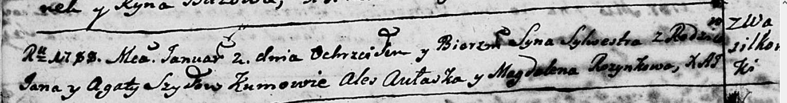

**Шило Сильвестр Янов (Szyło Sylwester)**

2 января 1788 г -- крещение (НИАБ 136-13-894, лист 3об, №3/1788-р
(ориг)).

**НИАБ 136-13-894:** Лист 3об. **Метрическая запись №3/1788-р (ориг).**

Дедиловичская Покровская церковь. 2 января 1788 года. Метрическая запись
о крещении.

Szyło Sylwester -- сын родителей с деревни Васильковка.

Szyło Jan -- отец.

Szyłowa Agata -- мать.

Aułaska Aleś - кум.

Rozynkowa Magdalena - кума.

Jazgunowicz Antoniusz -- ксёндз.
