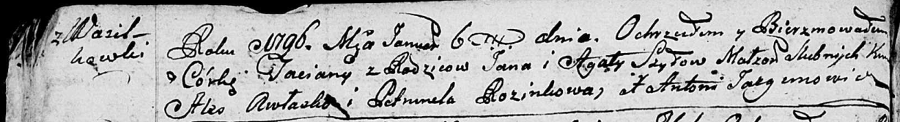

**Шило Татьяна Янова (Szyłowna Taciana)**

6 января 1795 г -- крещение (НИАБ 136-13-894, лист 27об, №4/1796-р
(ориг)).

**НИАБ 136-13-894:** Лист 27об. **Метрическая запись №4/1796-р (ориг).**

Дедиловичская Покровская церковь. 6 января 1796 года. Метрическая запись
о крещении.

Szyłowa Taсiana -- дочь родителей с деревни Васильковка.

Szyło Jan -- отец.

Szyłowa Agata -- мать.

Awłasko Aleś - кум.

Rozinkowa Petrunela - кума.

Jazgunowicz Antoni -- ксёндз.
