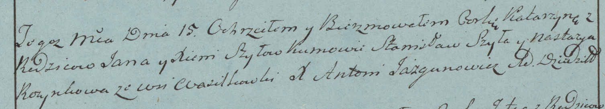
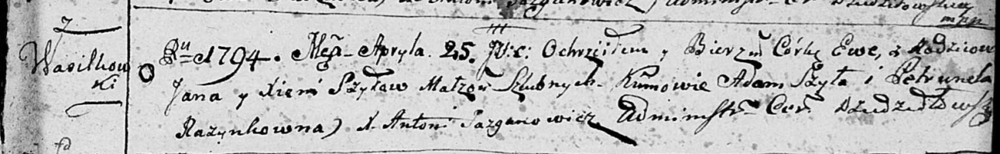

**Шило Ксеня (Szyłowa Xienia)**

15 декабря 1782г -- крещение дочери Катерины (РГИА 823-2-18, лист 223,
№14/1782-р (коп)).

25 апреля 1794 г -- крещение дочери Евы (НИАБ 136-13-894, лист 22,
№21/1794-р (ориг)).

**РГИА 823-2-18:** Лист 223. **Метрическая запись №14/1782-р (коп).**

Дедиловичская Покровская церковь. 15 декабря 1782 года. Метрическая
запись о крещении.

Szyłowna Katarzyna -- дочь родителей с деревни Васильковка.

Szyło Jan -- отец.

Szyłowa Xienia -- мать.

Szyło Stanisław -- кум.

Rozynkowa Nastazya - кума.

Jazgunowicz Antoni -- ксёндз.

**НИАБ 136-13-894:** Лист 22. **Метрическая запись №21/1794-р (ориг).**

Дедиловичская Покровская церковь. 25 апреля 1794 года. Метрическая
запись о крещении.

Szyłowna Ewa -- дочь родителей с деревни Васильковка.

Szyło Jan -- отец.

Szyłowa Xienia -- мать.

Szyło Adam - кум.

Razynkowna Petrunela - кума.

Jazgunowicz Antoni -- ксёндз.
