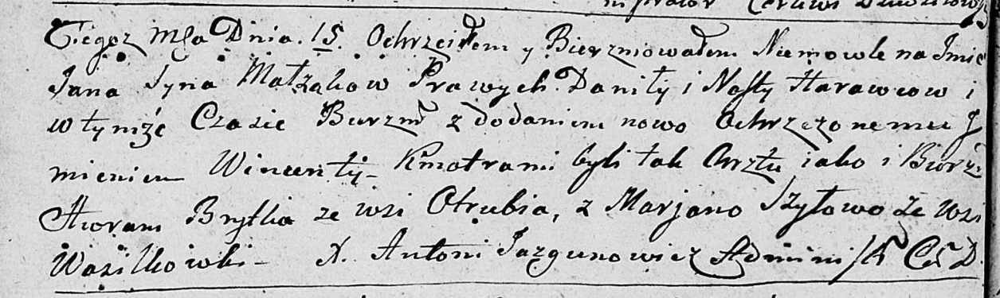

**Шило Марьяна (Szyłowa Marjana)**

16 сентября 1790 г -- крещение сына Иосифа (НИАБ 136-13-894, лист 11,
№3/1790-р (ориг)), (РГИА 823-2-18, лист 240об, №24/1790-р (коп)).

15 января 1800 г -- возможно, крестная мать у Яна Винцента, сына
Гаравцов Данилы и Насты (НИАБ 136-13-894, лист 40об, №4/1800-р (ориг)).

**НИАБ 136-13-894:** Лист 11. **Метрическая запись №60/1790-р (ориг).**

{width="6.496527777777778in"
height="1.0533639545056868in"}

Дедиловичская Покровская церковь. 16 сентября 1790 года. Метрическая
запись о крещении.

Szyło Jozef -- сын родителей с деревни Васильковка.

Szyło Jan -- отец.

Szyłowa Marjana -- мать.

Ro\... Symon - кум.

Skakunowa Aryna - кума.

Jazgunowicz Antoni -- ксёндз.

**РГИА 823-2-18:** Лист 240об. **Метрическая запись №24/1790-р (коп).**

{width="6.496527777777778in"
height="1.8541666666666667in"}

Дедиловичская Покровская церковь. 16 сентября 1790 года. Метрическая
запись о крещении.

Szyło Jezef -- сын родителей с деревни Васильковка.

Szyło Jan -- отец.

Szyłowa Marjanna -- мать.

Rozynka Symon -- кум.

Skakunowa Aryna - кума.

Jazgunowicz Antoni -- ксёндз.

**НИАБ 136-13-894:** Лист 40об. **Метрическая запись №4/1800-р (ориг).**

{width="6.496527777777778in"
height="1.9411132983377077in"}

Дедиловичская Покровская церковь. 15 января 1800 года. Метрическая
запись о крещении.

Harawcow Jan Wincenty -- сын.

Harawec Daniła -- отец.

Harawcowa Nasta -- мать.

Brytko Awram -- кум, с деревни Отруб.

Szyłowa Marjana -- кума, с деревни Васильковка.

Jazgunowicz Antoni -- ксёндз.
