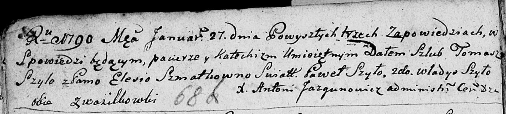

**Шматко (Шило) Елеся (Szyłowa Elesia z Szmatkow)**

27 января 1790 г -- венчание с Хомой Шило с деревни Васильковка (НИАБ
136-13-894, лист 68об, №3/1790-б (ориг)).

**НИАБ 136-13-894:** Лист 68об. **Метрическая запись №3/1790-б (ориг).**

{width="6.496527777777778in"
height="1.4637139107611548in"}

Дедиловичская Покровская церковь. 27 января 1790 года. Метрическая
запись о венчании.

Szyło Tomasz -- жених, с деревни Васильковка.

Szmatkowna Elesia -- невеста, с деревни Васильковка.

Szyło Paweł -- свидетель.

Szyło Władyś -- свидетель.

Jazgunowicz Antoni -- ксёндз.
