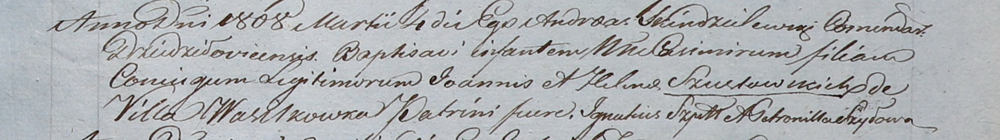

**Шустовский Казимир Иоаннов (Szustowski Joann)**

4 марта 1808 г -- крещение (НИАБ 937-4-32, лист 18, №11/1808-р).

**НИАБ 937-4-32:** Лист 18. **Метрическая запись №11/1808-р.**

Дедиловичский костел Наисвятейшего Сердца Иисуса. 4 марта 1808 года.
Метрическая запись о крещении.

Szustowski Casimir -- сын родителей с деревни Васильковка.

Szustowski Joann -- отец.

Szustowska Helena -- мать.

Szyło Jgnatius -- крестный отец.

Szyłowa Petronilla -- крестная мать.

Scindzelewski Andreas -- ксёндз, комендант Дедиловичский.
