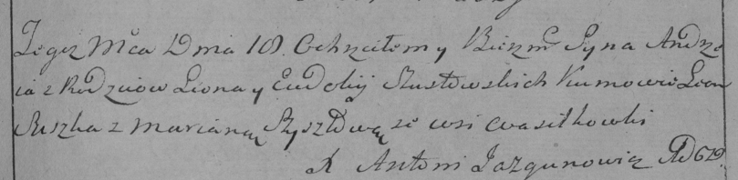

**Шустовский Андрей Леонов (Szustowski Andrzey)**

18 ноября 1795 г -- крещение (НИАБ 136-13-894, лист 26об, №55/1795-р
(ориг)), (РГИА 823-2-18, лист 254, №41/1795-р (коп)).

**НИАБ 136-13-894:** Лист 26об. **Метрическая запись №55/1795-р
(ориг).**

{width="6.496527777777778in"
height="1.582392825896763in"}

Дедиловичская Покровская церковь. 18 ноября 1795 года. Метрическая
запись о крещении.

Szustowski Andrzey -- сын родителей с деревни Васильковка.

Szustowski Leon -- отец.

Szustowska Ewdokija -- мать, деревня Васильковка.

Suszko Leon - кум.

Szyłowa Marjana - кума.

Jazgunowicz Antoni -- ксёндз.

**РГИА 823-2-18:** Лист 254. **Метрическая запись №41/1795-р (коп).**

{width="6.496527777777778in"
height="1.5902777777777777in"}

Дедиловичская Покровская церковь. 18 ноября 1795 года. Метрическая
запись о крещении.

Szustowski Andrzey -- сын родителей с деревни Васильковка.

Szustowski Leon -- отец.

Szustowska Ewdokija -- мать.

Suszka Leon -- кум.

\[Szyłowa\] Szyszłowa Mariana -- кума.

Jazgunowicz Antoni -- ксёндз.
