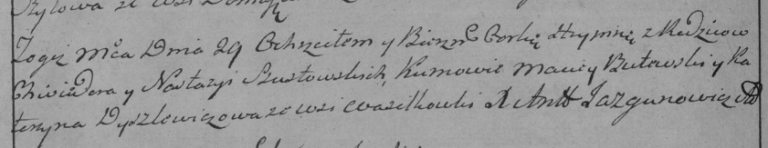

**Шустовская Агриппина Хведорова (Sustowska Ahrypina)**

29 июня 1788 г -- крещение (НИАБ 136-13-894, лист 4об, №37/1788-р
(ориг)), (РГИА 823-2-18, лист 236об, №19/1788-р (коп)).

**НИАБ 136-13-894:** Лист 4-об. **Метрическая запись №37/1788-р
(ориг).**

{width="6.496527777777778in"
height="0.890430883639545in"}

Дедиловичская Покровская церковь. 29 июня 1788 года. Метрическая запись
о крещении.

Sustowska Ahrypina -- дочь родителей с деревни Васильковка.

Sustowski Chwiedor -- отец.

Sustowska Nastazya -- мать.

Butewski Maciey - кум.

Dyszliewiczowa Katerzyna - кума.

Jazgunowicz Antoni -- ксёндз.

**РГИА 823-2-18:** Лист 236об. **Метрическая запись №19/1788-р (коп).**

{width="6.496527777777778in"
height="1.2590277777777779in"}

Дедиловичская Покровская церковь. 29 июня 1788 года. Метрическая запись
о крещении.

Szustowska Hrypina -- дочь родителей с деревни Васильковка.

Szustowski Chwiedor -- отец.

Szustowska Nastazya -- мать.

Butewski Maciey -- кум.

Dyszlewiczowa Katerzyna - кума.

Jazgunowicz Antoni -- ксёндз.
