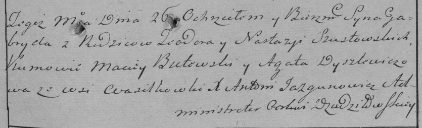
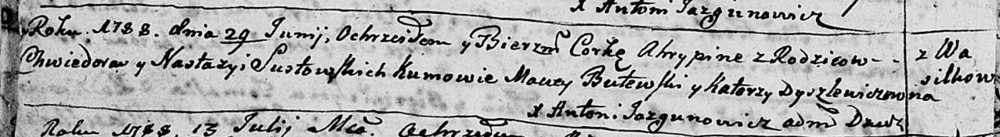
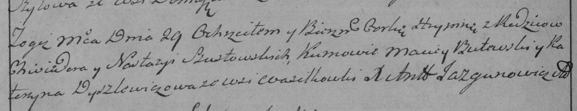
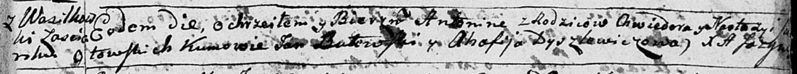
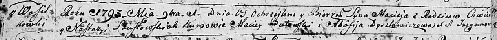
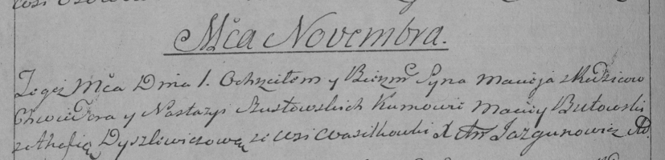
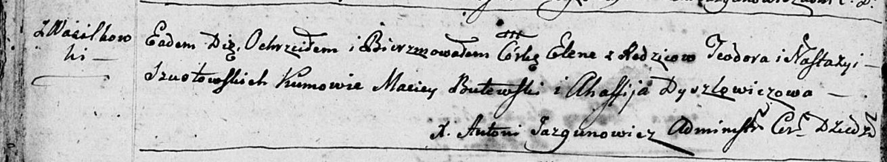
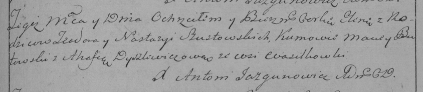
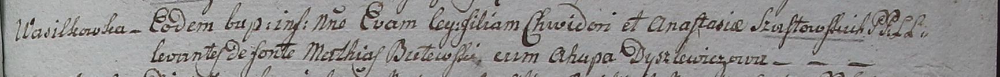
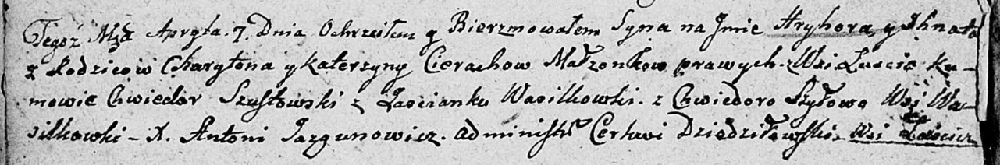

**Шустовский Хведор (Szustowski, Sustowski Chwiedor, Teodor)**

26 марта 1786 г -- крещение сына Габриэля (РГИА 823-2-18, лист 231,
№10/1786-р (коп)).

29 июня 1788 г -- крещение дочери Агриппины (НИАБ 136-13-894, лист 4об,
№37/1788-р (ориг)), (РГИА 823-2-18, лист 236об, №19/1788-р (коп)).

7 июня 1791 г -- крещение дочери Антонины (НИАБ 136-13-894, лист 13,
№25/1791-р (ориг)).

1 ноября 1793 г -- крещение сына Мацея (НИАБ 136-13-894, лист 20об,
№76/1793-р (ориг)), (РГИА 823-2-18, лист 248об, №42/1793-р (коп)).

18 мая 1796 г -- крещение дочери Елены (НИАБ 136-13-894, лист 29об,
№53/1796-р (ориг)), (РГИА 823-2-18, лист 256, №25/1796-р (коп)).

2 января 1799 г -- крещение дочери Евы (НИАБ 1781-27-199, лист 125,
№2/1799-р).

7 апреля 1807 г -- крестный отец Грыгора Игната, сына Церахов Харытона и
Катерыны с деревни Лустичи (НИАБ 136-13-894, лист 62об, №21/1807-р
(ориг)).

**РГИА 823-2-18:** Лист 231. **Метрическая запись №10/1786-р (коп).**

Дедиловичская Покровская церковь. 26 марта 1786 года. Метрическая запись
о крещении.

Szustowski Gabriel -- сын родителей с деревни Васильковка.

Szustowski Teodor -- отец.

Szustowska Nastazya -- мать.

Butewski Maciey -- кум.

Dyszlewiczowa Agata - кума.

Jazgunowicz Antoni -- ксёндз.

**НИАБ 136-13-894:** Лист 4-об. **Метрическая запись №37/1788-р
(ориг).**

Дедиловичская Покровская церковь. 29 июня 1788 года. Метрическая запись
о крещении.

Sustowska Ahrypina -- дочь родителей с деревни Васильковка.

Sustowski Chwiedor -- отец.

Sustowska Nastazya -- мать.

Butewski Maciey - кум.

Dyszliewiczowa Katerzyna - кума.

Jazgunowicz Antoni -- ксёндз.

**РГИА 823-2-18:** Лист 236об. **Метрическая запись №19/1788-р (коп).**

Дедиловичская Покровская церковь. 29 июня 1788 года. Метрическая запись
о крещении.

Szustowska Hrypina -- дочь родителей с деревни Васильковка.

Szustowski Chwiedor -- отец.

Szustowska Nastazya -- мать.

Butewski Maciey -- кум.

Dyszlewiczowa Katerzyna - кума.

Jazgunowicz Antoni -- ксёндз.

**НИАБ 136-13-894:** Лист 13. **Метрическая запись №25/1791-р (ориг).**

Дедиловичская Покровская церковь. 7 июня 1791 года. Метрическая запись о
крещении.

Sustowska Antonina -- дочь родителей с застенка Васильковка.

Sustowski Chwiedor -- отец.

Sustowska Nastazya -- мать.

Butewski Jan -- кум.

Dyszlewiczowa Ahafija - кума.

Jazgunowicz Antoni -- ксёндз.

**НИАБ 136-13-894:** Лист 20-об. **Метрическая запись №76/1793-р
(ориг).**

Дедиловичская Покровская церковь. 1 ноября 1793 года. Метрическая запись
о крещении.

Szustowski Maciey -- сын родителей с деревни Васильковка.

Szustowski Chwiedor -- отец.

Szustowska Nastazya-- мать.

Butewski Maciey - кум.

Dyszlewiczowa Ahafija - кума.

Jazgunowicz Antoni -- ксёндз.

**РГИА 823-2-18:** Лист 248об. **Метрическая запись №42/1793-р (коп).**

Дедиловичская Покровская церковь. 1 ноября 1793 года. Метрическая запись
о крещении.

Szustowski Maciey -- сын родителей с деревни Васильковка.

Szustowski Chwiedor -- отец.

Szustowska Nastazya -- мать.

Butowski Maciey -- кум.

Dyszlewiczowa Ahafia -- кума.

Jazgunowicz Antoni -- ксёндз.

**НИАБ 136-13-894:** Лист 29-об. **Метрическая запись №53/1796-р
(ориг).**

Дедиловичская Покровская церковь. 18 мая 1796 года. Метрическая запись о
крещении.

Szustowska Elena -- дочь родителей с деревни Васильковка.

Szustowski Teodor -- отец.

Szustowska Nastazya -- мать.

Butewski Maciey - кум.

Dyszlewiczowa Afafija - кума.

Jazgunowicz Antoni -- ксёндз.

**РГИА 823-2-18:** Лист 256. **Метрическая запись №25/1796-р (коп).**

Дедиловичская Покровская церковь. 18 мая 1796 года. Метрическая запись о
крещении.

Szustowska Elena -- дочь родителей с деревни Васильковка.

Szustowski Teodor -- отец.

Szustowska Nastazyia -- мать.

Butowski Maciey -- кум.

Dyszlewiczowa Ahafia -- кума.

Jazgunowicz Antoni -- ксёндз.

**НИАБ 1781-27-199:** Лист 125. **Метрическая запись №2/1799-р.**

Дедиловичский костел Наисвятейшего Сердца Иисуса. 2 января 1799 года.
Метрическая запись о крещении.

Szustowska Ewa -- дочь крестьян с деревни Васильковка.

Szustowski Chwiedor -- отец.

Szustowska Anastasia -- мать.

Butewski Matias -- крестный отец.

Dyszlewiczowa Ahapa - крестная мать.

Linhart Hyacinthus -- ксёндз.

**НИАБ 136-13-894:** Лист 62об. **Метрическая запись №21/1807-р
(ориг).**

Дедиловичская Покровская церковь. 7 апреля 1807 года. Метрическая запись
о крещении.

Cierach Hryhor Jhnat -- сын родителей с деревни Лустичи.

Cierach Charyton -- отец.

Cierachowa Katerzyna -- мать.

Szustowski Chwiedor -- кум, с застенока Васильковка.

Szyłowa Chwiedora -- кума, с деревни Васильковка.

Jazgunowicz Antoni -- ксёндз.
