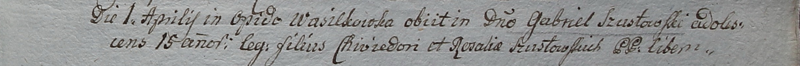

**Шустовский Хведор (Szustowski Chwiedor)**

1 апреля 1799 г -- отпевание сына Габриэля (НИАБ 1781-27-199, лист 127,
№9/1799-у).

**НИАБ 11781-27-199:** Лист 127. **Метрическая запись №9/1799-у.**

Дедиловичский костел Наисвятейшего Сердца Иисуса. 1 апреля 1799 года.
Метрическая запись об отпевании.

Szustowski Gabriel -- умерший, 15 лет, сын Chwiedori et Rosaliae с
деревни Васильковка.

Linhart Hyacinthus -- ксёндз.
