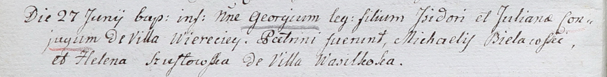

**Шустовская Елена (Szustowska Helena)**

27 июня 1802 г -- крестная мать Георгия, сына Изидора и Ульяны Дубовских
с деревни Веретей (НИАБ 937-4-32, лист 6об, №17/1802-р).

**НИАБ 937-4-32:** Лист 6об. **Метрическая запись №16/1802-р.**

{width="6.496527777777778in"
height="0.8354166666666667in"}

Дедиловичский костел Наисвятейшего Сердца Иисуса. 27 июня 1802 года.
Метрическая запись о крещении.

\[Dubowski\] Georgi -- сын родителей с деревни Веретей.

\[Dubowski\] Jsjdor -- отец.

\[Dubowska\] Juliana -- мать.

Bielawski Michael -- крестный отец.

Szustowska Helena -- крестная мать, с деревни Васильковка.

Linhart Hyacinthus -- ксёндз.
