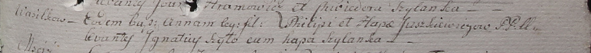

**Юшкевич Анна Филипова (Juszkiewiczowna Anna)**

30 июля 1799 г -- крещение дочери Анна (НИАБ 1781-27-199, лист 128,
№36/1799-р).

**НИАБ 1781-27-199:** Лист 128. **Метрическая запись №36/1799-р.**

{width="6.496527777777778in"
height="0.5868055555555556in"}

Дедиловичский костел Наисвятейшего Сердца Иисуса. 30 июля 1799 года.
Метрическая запись о крещении.

Juszkiewiczowna Anna -- дочь крестьян с деревни Васильковка.

Juszkiewicz Philip -- отец.

Juszkiewiczowa Hapa -- мать.

Szyło Jgnatiusz -- крестный отец.

Szyłanka Hapa -- крестная мать.

Linhart Hyacinthus -- ксёндз.
