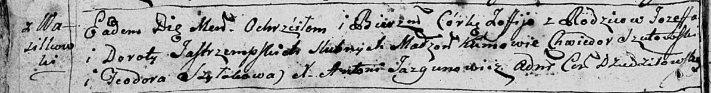

**Ястжембская Дорота (Jastrzepska, Jastrzempska Dorota)**

21 октября 1790 г -- крещение дочери Тересы (НИАБ 136-13-894, лист 11об,
№73/1790-р (ориг)).

1 октября 1794 г -- крещение дочери Марты (НИАБ 136-13-894, лист 22об,
№42/1794-р (ориг)).

23 марта 1796 г -- крещение дочери Зофии (НИАБ 136-13-894, лист 28об,
№36/1796-р (ориг)), (РГИА 823-2-18, лист 255об, №16/1796-р (коп)).

**НИАБ 136-13-894:** Лист 11об. **Метрическая запись №73/1790-р
(ориг).**

{width="6.496527777777778in"
height="0.7603532370953631in"}

Дедиловичская Покровская церковь. 21 октября 1790 года. Метрическая
запись о крещении.

Jastrzepska Teresa -- дочь родителей с деревни Васильковка.

Jastrzepski Jozef -- отец.

Jastrzepska Dorota -- мать.

Rozynka Symon - кум.

Niewiorkowa Ullana - кума.

Jazgunowicz Antoni -- ксёндз.

**НИАБ 136-13-894:** Лист 22об. **Метрическая запись №42/1794-р
(ориг).**

{width="6.496527777777778in"
height="1.0875601487314086in"}

Дедиловичская Покровская церковь. 1 октября 1794 года. Метрическая
запись о крещении.

Jastrzepska Marta -- дочь родителей с деревни Васильковка.

Jastrzepski Jozef -- отец.

Jastrzepska Dorota -- мать.

Szutowski Chwiedor - кум.

Szyłowa Teodora - кума.

Jazgunowicz Antoni -- ксёндз.

Лист 28-об. **Метрическая запись №36/1796-р (ориг).**

{width="6.496527777777778in"
height="0.8595877077865267in"}

Дедиловичская Покровская церковь. 23 марта 1796 года. Метрическая запись
о крещении.

Jastrzempska Zofija -- дочь родителей с деревни Васильковка.

Jastrzempski Jozef -- отец.

Jastrzempska Dorota -- мать.

Szutowski Chwiedor - кум.

Szyłakowa Teodora - кума.

Jazgunowicz Antoni -- ксёндз.

**РГИА 823-2-18:** Лист 255об. **Метрическая запись №16/1796-р (коп).**

{width="6.496527777777778in"
height="1.4527777777777777in"}

Дедиловичская Покровская церковь. 23 марта 1796 года. Метрическая запись
о крещении.

Jastrzemska Zofia -- дочь родителей с деревни Васильковка.

Jastrzemski Jezef -- отец.

Jastrzemska Dorota -- мать.

Szutowski Chwiedor -- кум.

Szyłakowa Teodora -- кума.

Jazgunowicz Antoni -- ксёндз.
