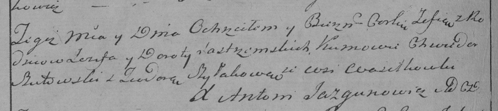

**Ястжембская Зофия Иосифова (Jastrzempska Zofija)**

23 марта 1796 г -- крещение (НИАБ 136-13-894, лист 28об, №36/1796-р
(ориг)), (РГИА 823-2-18, лист 255об, №16/1796-р (коп)).

Лист 28-об. **Метрическая запись №36/1796-р (ориг).**

{width="6.496527777777778in"
height="0.8595877077865267in"}

Дедиловичская Покровская церковь. 23 марта 1796 года. Метрическая запись
о крещении.

Jastrzempska Zofija -- дочь родителей с деревни Васильковка.

Jastrzempski Jozef -- отец.

Jastrzempska Dorota -- мать.

Szutowski Chwiedor - кум.

Szyłakowa Teodora - кума.

Jazgunowicz Antoni -- ксёндз.

**РГИА 823-2-18:** Лист 255об. **Метрическая запись №16/1796-р (коп).**

{width="6.496527777777778in"
height="1.4527777777777777in"}

Дедиловичская Покровская церковь. 23 марта 1796 года. Метрическая запись
о крещении.

Jastrzemska Zofia -- дочь родителей с деревни Васильковка.

Jastrzemski Jezef -- отец.

Jastrzemska Dorota -- мать.

Szutowski Chwiedor -- кум.

Szyłakowa Teodora -- кума.

Jazgunowicz Antoni -- ксёндз.
