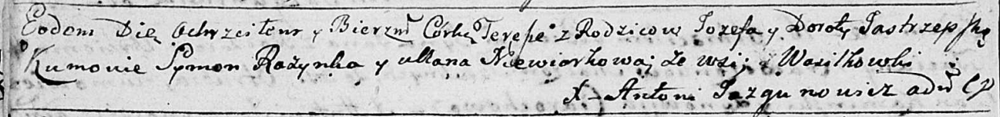

**Ястжембская Тереса Иосифова (Jastrzepska Teresa)**

21 октября 1790 г -- крещение (НИАБ 136-13-894, лист 11об, №73/1790-р
(ориг)).

**НИАБ 136-13-894:** Лист 11об. **Метрическая запись №73/1790-р
(ориг).**

{width="6.496527777777778in"
height="0.7603532370953631in"}

Дедиловичская Покровская церковь. 21 октября 1790 года. Метрическая
запись о крещении.

Jastrzepska Teresa -- дочь родителей с деревни Васильковка.

Jastrzepski Jozef -- отец.

Jastrzepska Dorota -- мать.

Rozynka Symon - кум.

Niewiorkowa Ullana - кума.

Jazgunowicz Antoni -- ксёндз.
