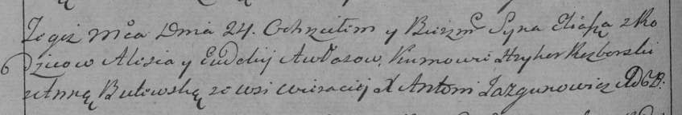

**Авласко Илья Елисеев (Awłasko Eliasz)**

24 июля 1792 г -- крещение (НИАБ 136-13-894, лист 16об, №41/1792-р
(ориг)), (РГИА 823-2-18, лист 244, №18/1792-р (коп)).

Лист 16об. **Метрическая запись №41/1792-р (ориг).**

{width="6.496527777777778in"
height="0.8957950568678915in"}

Дедиловичская Покровская церковь. 24 июля 1792 года. Метрическая запись
о крещении.

Awłasko Eliasz -- сын родителей с деревни Веретей.

Awłasko Elesij -- отец.

Awłaskowa Ewdokija -- мать.

Rozborski Hryhor - кум.

Butewska Anna - кума.

Jazgunowicz Antoni -- ксёндз.

**РГИА 823-2-18:** Лист 244об. **Метрическая запись №18/1792-р (коп).**

{width="6.496527777777778in"
height="1.1041666666666667in"}

Дедиловичская Покровская церковь. 24 июля 1792 года. Метрическая запись
о крещении.

Awłas Eliasz -- сын родителей с деревни Веретей.

Awłas Aleś -- отец.

Awłasowa Eudokija -- мать.

Rozborski Hryhor -- кум.

Butewska Anna -- кума.

Jazgunowicz Antoni -- ксёндз.
