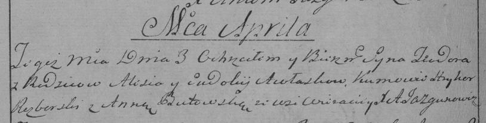

**Авласко Тодор Елисеев (Awłasko Teodor)**

3 мая 1796 г -- крещение (НИАБ 136-13-894, лист 29, №41/1796-р (ориг)),
(РГИА 823-2-18, лист 255об, №18/1796-р (коп)).

Лист 29. **Метрическая запись №41/1796-р (ориг).**

{width="6.496527777777778in"
height="0.9829615048118985in"}

Дедиловичская Покровская церковь. 3 мая 1796 года. Метрическая запись о
крещении.

Awłasko Teodor -- сын родителей с деревни Веретеи.

Awłasko Aleś -- отец.

Awłaskowa Ewdokija -- мать.

Rozborski Hryhor - кум.

Butewska Anna - кума.

Jazgunowicz Antoni -- ксёндз.

**РГИА 823-2-18:** Лист 255об. **Метрическая запись №18/1796-р (коп).**

{width="6.496527777777778in"
height="1.6520833333333333in"}

Дедиловичская Покровская церковь. 3 \[мая\] 1796 года. Метрическая
запись о крещении.

Awłasko Teodor -- сын родителей с деревни Веретей.

Awłasko Aleś -- отец.

Awłaskowa Ewdokia -- мать.

Rozborski Hryhor -- кум.

Butowska Anna -- кума.

Jazgunowicz Antoni -- ксёндз.
