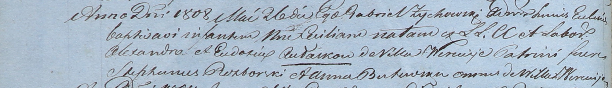

**Авласко Цецылия Елисеева (Awłaskowna Cecilia)**

26 мая 1808 г -- крещение (НИАБ 937-4-32, лист 18об, №17/1808-р).

**НИАБ 937-4-32:** Лист 18об. **Метрическая запись №17/1808-р.**

{width="6.496527777777778in"
height="0.9388888888888889in"}

Дедиловичский костел Наисвятейшего Сердца Иисуса. 26 мая 1808 года.
Метрическая запись о крещении.

Aułaskowna Cecilia -- дочь крестьян с деревни Веретей.

Aułasko Alexander -- отец.

Aułaskowa Eudokia -- мать.

Rozborski Stephan -- крестный отец, с деревни Веретей.

Butewska Anna -- крестная мать, с деревни Веретей.

Zychowski Gabriel -- ксёндз.
