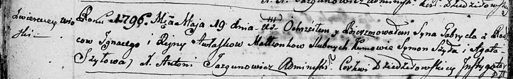

**Авласко Габриэль Игнатов (Awłasko Gabriel)**

19 мая 1796 г -- крещение (НИАБ 136-13-894, лист 29об, №55/1796-р
(ориг)), (РГИА 823-2-18, лист 256, №27/1796-р (коп)).

Лист 29-об. **Метрическая запись №55/1796-р (ориг).**

Дедиловичская Покровская церковь. 19 мая 1796 года. Метрическая запись о
крещении.

Awłasko Gabriel -- сын родителей с деревни Веретеи.

Awłasko Jhnacy -- отец.

Awłaskowa Ryna -- мать.

Szyło Symon - кум.

Szyłowa Agata - кума.

Jazgunowicz Antoni -- ксёндз.

**РГИА 823-2-18:** Лист 256. **Метрическая запись №27/1796-р (коп).**

Дедиловичская Покровская церковь. 19 мая 1796 года. Метрическая запись о
крещении.

Awłasko Gabryel -- сын родителей с деревни Веретей.

Awłasko Jhnacy -- отец.

Awłaskowa Jryna -- мать.

Szyła Symon -- кум.

Szyłowa Agata -- кума.

Jazgunowicz Antoni -- ксёндз.
