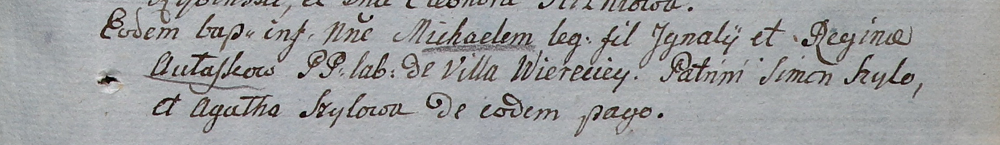

**Авласко Михал Игнатов (Aułasko Michael)**

15 октября 1805 г -- крещение (НИАБ 937-4-32, лист 12, №37/1800-р).

**НИАБ 937-4-32:** Лист 12. **Метрическая запись №37/1805-р.**

Дедиловичский костел Наисвятейшего Сердца Иисуса. 15 октября 1805 года.
Метрическая запись о крещении.

Aułasko Michael -- сын крестьян с деревни Веретей.

Aułasko Jgnati -- отец.

Aułaskowa Regina -- мать.

Szyło Simon -- крестный отец.

Szyłowa Agatha -- крестная мать, с деревни Веретей.

Linhart Hiacinthus -- ксёндз.
