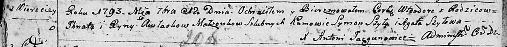

**Авласко Тодора, Втеодора Игнатова (Awłaskowna Wteodora, Teodora)**

12 сентября 1793 г -- крещение (НИАБ 136-13-894, лист 20об, №66/1793-р
(ориг)).

19 июля 1795 г -- отпевание, умерла в возрасте 2 лет (НИАБ 136-13-919,
лист 5, №26/1795-у (ориг)).

**НИАБ 136-13-894:** Лист 20-об. **Метрическая запись №66/1793-р
(ориг).**

Дедиловичская Покровская церковь. 12 сентября 1793 года. Метрическая
запись о крещении.

Awłaskowna Wteodora -- дочь родителей с деревни Веретеи.

Awłasko Jhnat -- отец.

Awłaskowa Ryna-- мать.

Szyło Symon - кум.

Szyłowa Agata - кума.

Jazgunowicz Antoni -- ксёндз.

**НИАБ 136-13-919:** Лист 5. **Метрическая запись №26/1795-у (ориг).**

Дедиловичская Покровская церковь. 19 июля 1795 года. Метрическая запись
об отпевании.

Aułaskowna Teodora -- умершая, 2 года, с деревни Веретей, похоронена на
кладбище деревни Веретей.

Jazgunowicz Antoni -- ксёндз.
