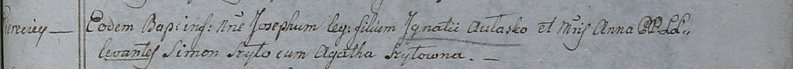

**Авласко Анна (Awłaskowa Anna)**

12 октября 1798 г -- крещение сына Иосифа (НИАБ 1781-27-199, лист 123,
№12/1798-р).

**НИАБ 1781-27-199:** Лист 123. **Метрическая запись №12/1798-р.**

{width="6.496527777777778in"
height="0.5694444444444444in"}

Дедиловичский костел Наисвятейшего Сердца Иисуса. 12 октября 1798 года.
Метрическая запись о крещении.

Aułasko Joseph -- сын крестьян с деревни Веретей.

Aułasko Jgnaty -- отец.

Aułaskowa Anna -- мать.

Szyło Simon -- крестный отец.

Szyłowna Agatha - крестная мать.

Linhart Hyacinthus -- ксёндз.
