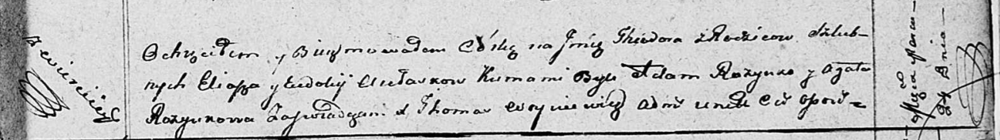

**Авласко Тодора Ильина (Awłaskowna Teodora)**

24 марта 1812 г -- крещение (НИАБ 136-13-894, лист 84, №19/1812-р
(ориг)).

**НИАБ 136-13-894:** Лист 84. **Метрическая запись №19/1812-р (ориг).**

Осовская Покровская церковь. 24 марта 1812 года. Метрическая запись о
крещении.

Aulaskowna Teodora -- дочь родителей с деревни Веретей.

Aulasko Eliasz -- отец.

Aulaskowa Ewdokija -- мать.

Rozynko Adam -- кум.

Rozynkowa Agata -- кума.

Woyniewicz Tomasz -- ксёндз.
