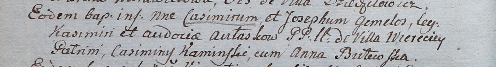

**Авласко Казимир Казимиров (Awłasko Casimir Joseph)**

10 апреля 1805 г -- крещение (НИАБ 937-4-32, лист 11об, №17/1805-р).

**НИАБ 937-4-32:** Лист 11об. **Метрическая запись №17/1805-р.**

Дедиловичский костел Наисвятейшего Сердца Иисуса. 10 апреля 1805 года.
Метрическая запись о крещении.

Aułasko Casimir Joseph -- сын родителей с деревни Веретей.

Aułasko Kasimir -- отец.

Aułaskowa Audocia -- мать.

Kaminski Casimir -- крестный отец.

Butewska Anna -- крестная мать.

Linhart Hiacinthus -- ксёндз.
