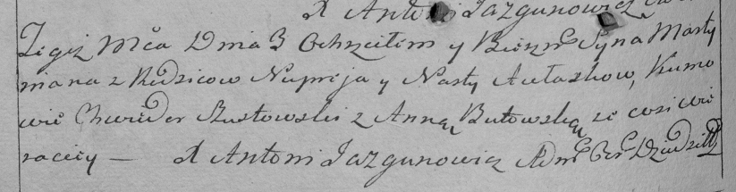

**Авласко Нупрей (Awłasko Nuprej)**

8 ноября 1790 г -- крещение дочери Хрыстыны (НИАБ 136-13-894, лист 11об,
№81/1790-р (ориг)).

3 июля 1793 г -- крещение сына Мартымьяна (НИАБ 136-13-894, лист 20,
№53/1793-р (ориг)), (РГИА 823-2-18, лист 247об, №27/1793-р (коп)).

**НИАБ 136-13-894:** Лист 11об. **Метрическая запись №81/1790-р
(ориг).**

{width="6.496527777777778in"
height="0.8656222659667542in"}

Дедиловичская Покровская церковь. 8 ноября 1790 года. Метрическая запись
о крещении.

Awłaskowna Krystyna -- дочь родителей с деревни Веретеи.

Awłaska Nuprej -- отец.

Awłaskowa Nasta -- мать.

Szustowski Chwiedor - кум.

Butowska Anna - кума.

Jazgunowicz Antoni -- ксёндз.

**НИАБ 136-13-894:** Лист 20. **Метрическая запись №53/1793-р (ориг).**

{width="6.496527777777778in"
height="0.7764457567804024in"}

Дедиловичская Покровская церковь. 3 июля 1793 года. Метрическая запись о
крещении.

Aułaska Martymian -- сын родителей с деревни Веретеи.

Aułaska Nuprey -- отец.

Aułaska Nasta -- мать.

Szustowski Chwiedor - кум.

Butewska Anna - кума.

Jazgunowicz Antoni -- ксёндз.

**РГИА 823-2-18:** Лист 247об. **Метрическая запись №27/1793-р (коп).**

{width="6.496527777777778in"
height="1.6972222222222222in"}

Дедиловичская Покровская церковь. 3 июля 1793 года. Метрическая запись о
крещении.

Aułasko Martymian -- сын родителей с деревни Веретей.

Aułasko Nuprey -- отец.

Aułaskowa Nasta -- мать.

Szustowski Chwiedor -- кум.

Butowska Anna -- кума.

Jazgunowicz Antoni -- ксёндз.
