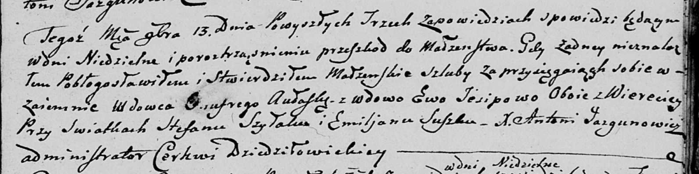

**Авласко Онуфры (Awłasko Onufry)**

13 ноября 1804 г -- венчание с вдовой Евой Есиповой с деревни Веретей
(НИАБ 136-13-920, лист 11, №14/1804-б (ориг)).

**НИАБ 136-13-920:** Лист 11. **Метрическая запись №14/1804-б (ориг).**

Дедиловичская Покровская церковь. 13 ноября 1804 года. Метрическая
запись о венчании.

Aułasko Onufry -- жених, вдовец, с деревни Веретей.

Jesipowa Ewa -- невеста, вдова, с деревни Веретей.

Szyłak Stefan -- свидетель.

Suszko Emiljan -- свидетель.

Jazgunowicz Antoni -- ксёндз.
