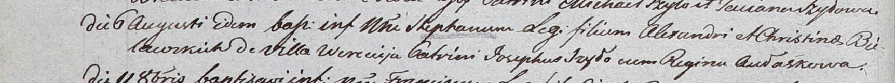

**Белявский Стефан Александров (Bielawski Stephan)**

6 августа 1803 г -- крещение (НИАБ 937-4-32, лист 9об, №24/1803-р).

**НИАБ 937-4-32:** Лист 9об. **Метрическая запись №24/1803-р.**

Дедиловичский костел Наисвятейшего Сердца Иисуса. 6 августа 1803 года.
Метрическая запись о крещении.

Bielawski Stephan -- сын родителей с деревни Веретей.

Bielawski Alexander -- отец.

Bielawska Christina -- мать.

Szyło Joseph -- крестный отец.

Aułaskowa Regina -- крестная мать.

Kłoczko Antoni -- ксёндз, администратор Ошмянского костела.
