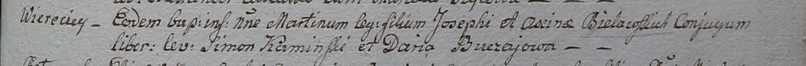

**Белявский Иосиф (Bielawski Joseph)**

27 января 1799 г -- крещение сына Мартина (НИАБ 1781-27-199, лист 125,
№12/1799-р).

**НИАБ 1781-27-199:** Лист 125. **Метрическая запись №12/1799-р.**

Дедиловичский костел Наисвятейшего Сердца Иисуса. 27 января 1799 года.
Метрическая запись о крещении.

Bielawski Martin -- сын крестьян с деревни Веретей.

Bielawski Joseph -- отец.

Bielawska Axina -- мать.

Kaminski Simon -- крестный отец.

Buczajowa Daria - крестная мать.

Linhart Hyacinthus -- ксёндз.
