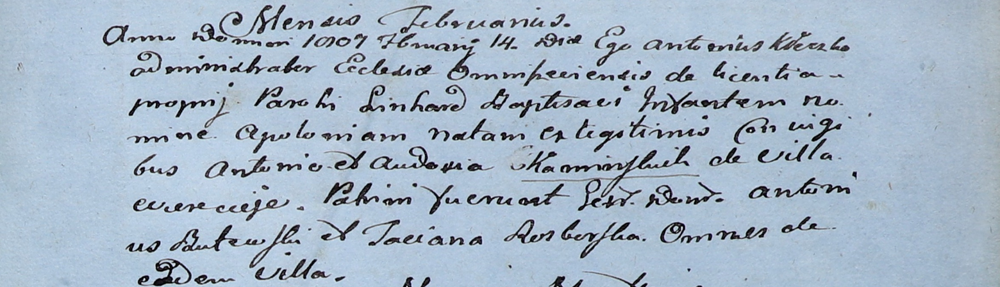

**Бутовский Антон (Butewski Antoni)**

2 января 1805 г -- крестный отец Элизабеты, дочери Изыдора и Ульяны
Дубовских с деревни Веретей (НИАБ 937-4-32, лист 11, №3/1805-р).

14 февраля 1807 г -- крестный отец Аплонии, дочери Антония и Евдокии
Каминских с деревни Веретей (НИАБ 136-13-894, лист 15, №5/1807-р).

**НИАБ 937-4-32:** Лист 11. **Метрическая запись №3/1805-р.**

Дедиловичский костел Наисвятейшего Сердца Иисуса. 2 января 1805 года.
Метрическая запись о крещении.

Dubowska Elisabetha -- дочь родителей с деревни Веретей.

Dubowski Jsidor -- отец.

Dubowska Juliana -- мать.

Butewski Antoni -- крестный отец, с деревни Веретей.

Szustowska Helena -- крестная мать, с деревни Веретей.

Linhart Hiacinthus -- ксёндз.

**НИАБ 937-4-32:** Лист 15. **Метрическая запись №5/1807-р.**

Дедиловичский костел Наисвятейшего Сердца Иисуса. 14 февраля 1807 года.
Метрическая запись о крещении.

Kaminska Apołonia -- дочь родителей с деревни Веретей.

Kaminski Antoni -- отец.

Kaminska Audocia -- мать.

Butewski Antoni -- крестный отец, с деревни Веретей.

Rozborska Taciana -- крестная мать, с деревни Веретей.

Kłoczko Antonius -- ксёндз, администратор костела Омнишевского.
