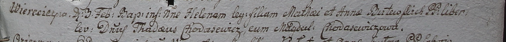

**Бутовская Елена Матеева (Butewska Helena)**

3 февраля 1799 г -- крещение (НИАБ 1781-27-199, лист 125, №14/1799-р).

**НИАБ 1781-27-199:** Лист 125. **Метрическая запись №14/1799-р.**

Дедиловичский костел Наисвятейшего Сердца Иисуса. 3 февраля 1799 года.
Метрическая запись о крещении.

Butewska Helena -- дочь крестьян с деревни Веретей.

Butewski Mathei -- отец.

Butewska Anna -- мать.

Chodasewicz Thadei -- крестный отец, шляхтич.

Chodasewiczowa Magdala - крестная мать, шляхтянка.

Linhart Hyacinthus -- ксёндз.
