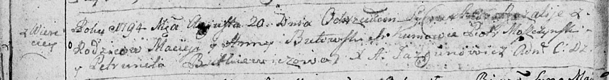

**Бутовский Розалия Мацеева (Butowska Rozalia)**

20 августа 1794 г -- крещение (НИАБ 136-13-894, лист 22об, №33/1794-р
(ориг)).

**НИАБ 136-13-894:** Лист 22об. **Метрическая запись №33/1794-р
(ориг).**

Дедиловичская Покровская церковь. 20 августа 1794 года. Метрическая
запись о крещении.

Butowska Rozalia -- дочь родителей с деревни Веретеи.

Butowski Maciey -- отец.

Butowska Anna -- мать.

Moszczynski Piotr - кум.

Butkiewiczowa Petrunela - кума.

Jazgunowicz Antoni -- ксёндз.
