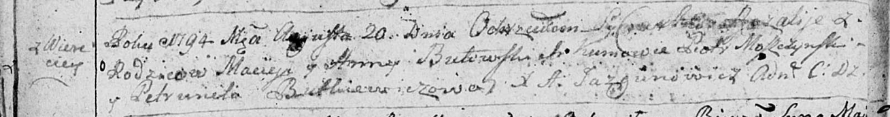

**Бутовский Мацей (Butowski, Butewski Maciey, Mathei)**

20 августа 1794 г -- крещение дочери Розалии (НИАБ 136-13-894, лист
22об, №33/1794-р (ориг)).

3 февраля 1799 г -- крещение дочери Елены (НИАБ 1781-27-199, лист 125,
№14/1799-р).

25 августа 1801 г -- крещение дочери Элизабеты (НИАБ 937-4-32, лист 4об,
№16/1801-р).

31 мая 1803 г -- крещение сына Юстына (НИАБ 937-4-32, лист 9об,
№14/1803-р).

**НИАБ 136-13-894:** Лист 22об. **Метрическая запись №33/1794-р
(ориг).**

Дедиловичская Покровская церковь. 20 августа 1794 года. Метрическая
запись о крещении.

Butowska Rozalia -- дочь родителей с деревни Веретеи.

Butowski Maciey -- отец.

Butowska Anna -- мать.

Moszczynski Piotr - кум.

Butkiewiczowa Petrunela - кума.

Jazgunowicz Antoni -- ксёндз.

**НИАБ 1781-27-199:** Лист 125. **Метрическая запись №14/1799-р.**

Дедиловичский костел Наисвятейшего Сердца Иисуса. 3 февраля 1799 года.
Метрическая запись о крещении.

Butewska Helena -- дочь крестьян с деревни Веретей.

Butewski Mathei -- отец.

Butewska Anna -- мать.

Chodasewicz Thadei -- крестный отец, шляхтич.

Chodasewiczowa Magdala - крестная мать, шляхтянка.

Linhart Hyacinthus -- ксёндз.

**НИАБ 937-4-32:** Лист 4об. **Метрическая запись №16/1801-р.**

Дедиловичский костел Наисвятейшего Сердца Иисуса. 25 августа 1801 года.
Метрическая запись о крещении.

Butewska Elisabetha -- дочь вольных людей с деревни Веретей.

Butewski Mathias -- отец.

Butewska Anna -- мать.

Chodasewicz Thadeusz -- крестный отец, шляхтич.

Czarnocka Victoria -- крестная мать, шляхтянка.

Łomacki Jgnatius- ассистент, шляхтич.

Czarnocka Angela - ассистентка, шляхтянка, девица, ротмистровша Минская.

Linhart Hyacinthus -- ксёндз.

**НИАБ 937-4-32:** Лист 9об. **Метрическая запись №14/1803-р.**

Дедиловичский костел Наисвятейшего Сердца Иисуса. 31 мая 1803 года.
Метрическая запись о крещении.

Butewski Justyn -- сын шляхтичей с деревни Веретей.

Butewski Maciey -- отец.

Butewska Anna -- мать.

Chodasewicz Tadeusz -- крестный отец, шляхтич, эконом Домашковичский.

Arciszewska Franciszka -- крестная мать, шляхтянка.

Jesipowicz Wincenty - ассистент, шляхтич.

Woytkiewiczowa Ewa - ассистентка, шляхтянка, с деревни Замосточье.

Galinowski Joann -- ксёндз, комендант Дедиловичского костела.
