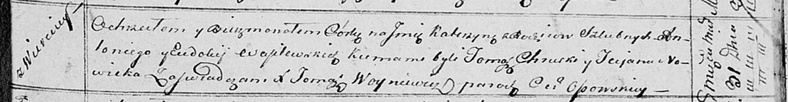

**Василевская Катерына Антониева (Wasilewska Katerzyna)**

31 марта 1814 г -- крещение (НИАБ 136-13-894, лист 89, №21/1814-р
(ориг)).

**НИАБ 136-13-894:** Лист 89. **Метрическая запись №21/1814-р (ориг).**

Осовская Покровская церковь. 31 марта 1814 года. Метрическая запись о
крещении.

Wasilewska Katerzyna -- дочь родителей с деревни Веретей.

Wasilewski Antonij -- отец.

Wasilewska Ewdokija -- мать.

Chrucki Tomasz -- кум.

Nowicka Tacjana -- кума.

Woyniewicz Tomasz -- ксёндз.
