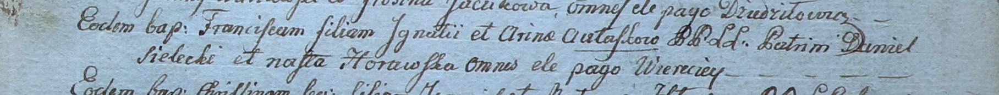

**Горавская Наста (Horawska Nasta)**

28 марта 1800 г -- крестная мать Франциска, сына Игнатия и Рыны Авласков
с деревни Веретей (НИАБ 937-4-32, лист 1, №9/1800-р).

**НИАБ 937-4-32:** Лист 1. **Метрическая запись №9/1800-р.**

Дедиловичский костел Наисвятейшего Сердца Иисуса. 28 марта 1800 года.
Метрическая запись о крещении.

Aułasko Francisc -- сын крестьян с деревни Веретей.

Aułasko Jgnati -- отец.

Aułaskowa Arina -- мать.

Sielecki Daniel -- крестный отец, с деревни Веретей.

Horawska Nasta -- крестная мать, с деревни Веретей.

Linhart Hyacinthus -- ксёндз.
