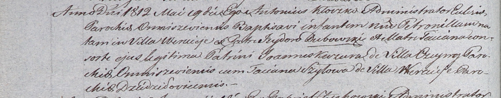

**Дубовская Татьяна (Dubowska Taciana)**

19 мая 1812 г -- крещение дочери Петронели (НИАБ 937-4-32, лист 24об,
№8/1812-р).

**НИАБ 937-4-32:** Лист 24об. **Метрическая запись №8/1812-р.**

{width="6.496527777777778in"
height="1.2798611111111111in"}

Дедиловичский костел Наисвятейшего Сердца Иисуса. 19 мая 1812 года.
Метрическая запись о крещении.

Dubowska Petronilla -- дочь крестьян с деревни Веретей.

Dubowski Jsydor -- отец.

Dubowska Taciana -- мать.

Kuzura Joann -- крестный отец, с деревни Чупры парохии Омнишевской.

Szyłowa Taciana -- крестная мать, с деревни Веретей.

Kłoczko Antonius -- ксёндз, администратор Омнишевский.
