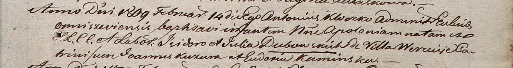

**Дубовская АполонияИзыдорова (Dubowska Apołonia)**

14 февраля 1809 г -- крещение (НИАБ 937-4-32, лист 19, №8/1809-р).

**НИАБ 937-4-32:** Лист 19. **Метрическая запись №8/1809-р.**

{width="6.496527777777778in"
height="0.8701388888888889in"}

Дедиловичский костел Наисвятейшего Сердца Иисуса. 14 февраля 1809 года.
Метрическая запись о крещении.

Dubowska Apołonia -- дочь крестьян с деревни Веретей.

Dubowski Jzidor -- отец.

Dubowska Julia -- мать.

Kuzura Joann -- крестный отец.

Kaminska Eudokia -- крестная мать.

Kłoczko Antonius -- ксёндз, администратор Ошмянский.
