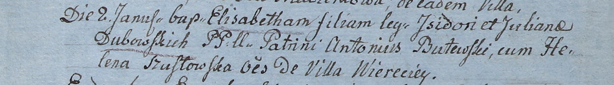

**Дубовский Стефан Изыдоров (Dubowski Stephan)**

2 января 1808 г -- крещение (НИАБ 937-4-32, лист 17об, №1/1808-р).

**НИАБ 937-4-32:** Лист 17об. **Метрическая запись №1/1808-р.**

{width="6.496527777777778in"
height="0.9in"}

Дедиловичский костел Наисвятейшего Сердца Иисуса. 2 января 1808 года.
Метрическая запись о крещении.

Dubowski Stephan -- сын крестьян с деревни Веретей.

Dubowski Jsydor -- отец.

Dubowska Juliana -- мать.

Kuzura Joann -- крестный отец.

Szucikowa Helena -- крестная мать.

Kłoczko Antonius -- ксёндз, администратор Омнишевский.
