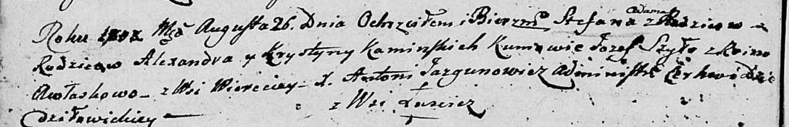

**Каминская Крыстына (Kaminska Krystyna)**

26 августа 1803 г -- крещение сына Степана Адама (НИАБ 136-13-894, лист
51об, №34/1803-р (ориг)).

**НИАБ 136-13-894:** Лист 51об. **Метрическая запись №34/1803-р
(ориг).**

{width="6.496527777777778in"
height="1.0540343394575677in"}

Дедиловичская Покровская церковь. 26 августа 1803 года. Метрическая
запись о крещении.

Kaminski Stefan Adam -- сын родителей с деревни Веретей.

Kaminski Alexander -- отец.

Kaminska Krystyna -- мать.

Szyło Jozef -- кум.

Awłaskowa Rina? -- кума.

Jazgunowicz Antoni -- ксёндз.
