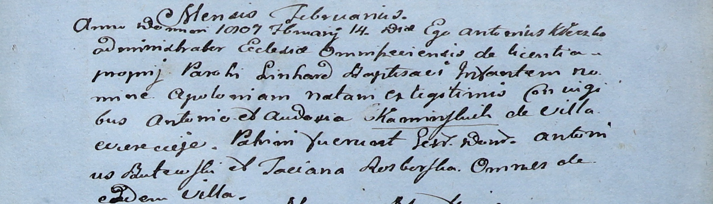

**Каминская Аполония Антониева (Kaminska Apołonia)**

14 февраля 1807 г -- крещение (НИАБ 136-13-894, лист 15, №5/1807-р).

**НИАБ 937-4-32:** Лист 15. **Метрическая запись №5/1807-р.**

Дедиловичский костел Наисвятейшего Сердца Иисуса. 14 февраля 1807 года.
Метрическая запись о крещении.

Kaminska Apołonia -- дочь родителей с деревни Веретей.

Kaminski Antoni -- отец.

Kaminska Audocia -- мать.

Butewski Antoni -- крестный отец, с деревни Веретей.

Rozborska Taciana -- крестная мать, с деревни Веретей.

Kłoczko Antonius -- ксёндз, администратор костела Омнишевского.
