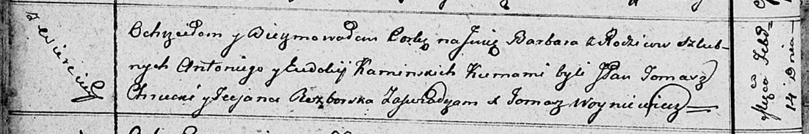

**Каминская Варвара Антониева (Kaminska Barbara)**

14 февраля 1812 г -- крещение (НИАБ 136-13-894, лист 83об, №11/1812-р
(ориг)).

**НИАБ 136-13-894:** Лист 83об. **Метрическая запись №11/1812-р
(ориг).**

{width="6.496527777777778in"
height="1.0795133420822398in"}

Осовская Покровская церковь. 14 февраля 1812 года. Метрическая запись о
крещении.

Kaminska Barbara -- дочь родителей с деревни Веретей.

Kaminski Antoni -- отец.

Kamiska Eudokija -- мать.

Chrucki Tomasz, JP -- кум, шляхтич.

Rozborska Taciana -- кума.

Woyniewicz Tomasz -- ксёндз.
