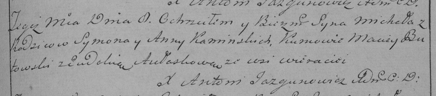

**Каминский Михал Сымонов (Kaminski Michał)**

8 ноября 1790 г -- крещение (НИАБ 136-13-894, лист 11об, №80/1790-р
(ориг)), (РГИА 823-2-18, лист 241, №30/1790-р (коп)).

**НИАБ 136-13-894:** Лист 11об. **Метрическая запись №80/1790-р
(ориг).**

{width="6.496527777777778in"
height="0.8361198600174978in"}

Дедиловичская Покровская церковь. 8 ноября 1790 года. Метрическая запись
о крещении.

Kaminski Michał -- сын родителей с деревни Веретеи.

Kaminski Symon -- отец.

Kaminska Anna -- мать.

Butewski Maciey - кум.

Awłaskowa Ewdokija - кума.

Jazgunowicz Antoni -- ксёндз.

**РГИА 823-2-18:** Лист 241. **Метрическая запись №30/1790-р (коп).**

{width="6.496527777777778in"
height="1.43125in"}

Дедиловичская Покровская церковь. 8 ноября 1790 года. Метрическая запись
о крещении.

Kaminski Michał -- сын родителей с деревни Веретей.

Kaminski Symon -- отец.

Kaminska Anna -- мать.

Butowski Maciey -- кум.

Aułaskowa Eudokia - кума.

Jazgunowicz Antoni -- ксёндз.
